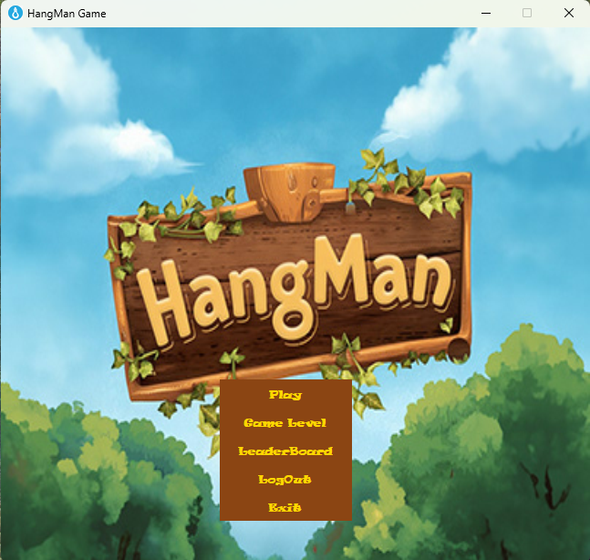
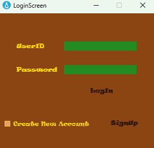
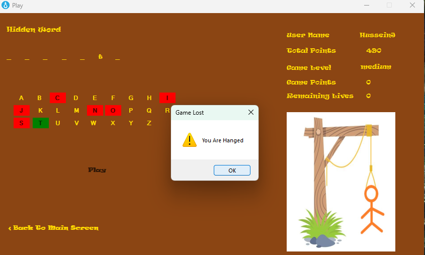
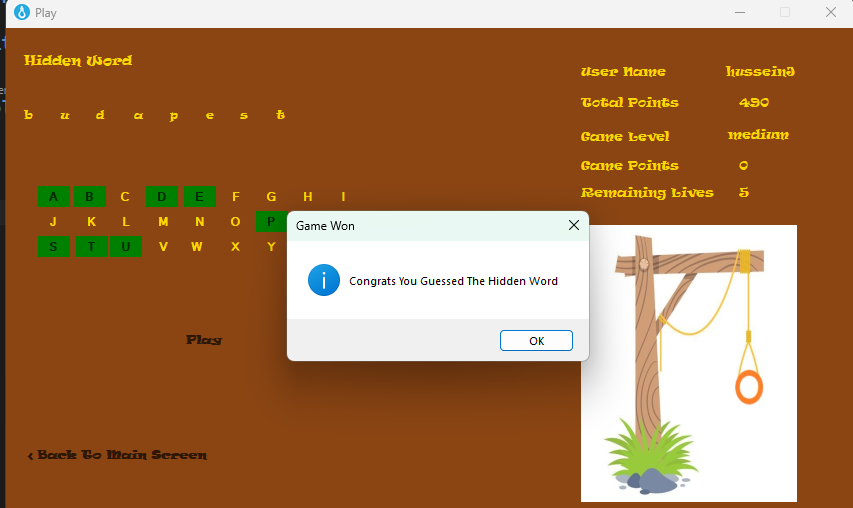
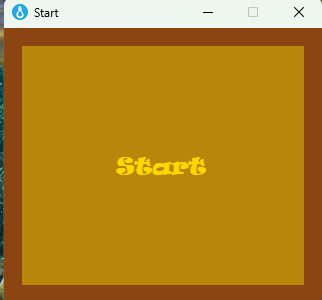

World-Cities-Hangman-Game

A 3-tier WinForms application in C# that implements a Hangman game using world city names.This project demonstrates clean separation of concerns with distinct layers for UI, business logic, and data access.

📂 Project Structure

Hangman_winapp_3_tier: Presentation layer (WinForms UI)

PlayersBusinessLayer: Business logic layer (game rules, validation, scoring)

PlayersDataAccessLayer: Data access layer (storage and retrieval of player data)

🚀 How to Run

Clone the repository:

git clone git@github.com:HAJS78/World-Cities-Hangman-Game.git

Open the solution in Visual Studio.

Build the project.

Run the Hangman_winapp_3_tier project to start the game.

🎮 Features

Classic Hangman gameplay with world city names.

3-tier architecture for maintainability and scalability.

Player data management through the data access layer.

Business rules enforced in the business layer.

🗄️ Database Setup

This project uses Microsoft SQL Server.To set up the database:

Open SQL Server Management Studio (SSMS).

Run the script located in /DatabaseScripts/WorldCitiesHangman.sql.

Update the connection string in the app configuration if needed.

## 🖼️ Screenshots

### Main Game Window

### Player Login

### Wrong Guess Example

### Victory Screen

### Start Screen

🛠️ Technologies Used

C#

WinForms (.NET)

Microsoft SQL Server (for game database)

GitHub for version control

🎨 Assets

Gallows illustrations: Original variations created for gameplay (6 stages showing body parts added on wrong guesses).

Main screen background: Sourced from free resources. If attribution is required, please contact me.

📖 License

This project is licensed under the MIT License. See the LICENSE file for details.

## 📅 Timeline
- Started: October 2024  
- Completed: October 2024